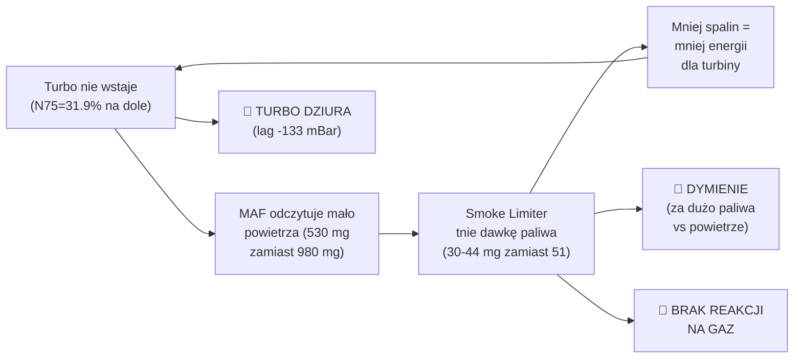

# DIAGNOSTYKA: DYMIENIE / TURBO LAG / BRAK REAKCJI NA GAZ
## Plik w aucie: `cks ok` — VW T4 2.5 TDI AXG (EDC15VM+)

---

## DIAGNOZA: BŁĘDNE KOŁO (VICIOUS CIRCLE)

Trzy problemy to **jeden problem** — wzajemnie się napędzają:

---

## 1. DYMIENIE NA WOLNYCH OBROTACH

### Dowody z logów VCDS:

| RPM | Pedał | MAF rzecz. | MAF żąd. | Stosunek | IQ Smoke | IQ Torque | **Aktywny limiter** |
|:---:|:---:|:---:|:---:|:---:|:---:|:---:|:---:|
| **1469** | WOT | **530** | 980 | **54%** | brak danych | — | ? |
| **1489** | WOT | ~530* | 980 | ~54% | **44.4** | 46.0 | 🔴 **SMOKE** |
| **1510** | WOT | ~500* | 980 | ~51% | **30.0** | 45.6 | 🔴 **SMOKE** |
| **1918** | partial | 320 | 380 | 84% | **23.2** | 50.2 | DRV (2.8 mg) |
| **1938** | WOT | 535 | 700 | 76% | 51.0 | 50.4 | ⚠️ TORQUE |

*\* szacowane z sąsiednich pomiarów (logi VCDS z różnych plików CSV)*

### Co się dzieje:

> [!CAUTION]
> **Przy 1489 RPM na pełnym gazie:**
> - Kierowca prosi o **51.0 mg** paliwa (Driver Wish)
> - Torque Limiter pozwala na **46.0 mg**
> - Smoke Limiter ogranicza do **44.4 mg** ← TEN LIMITER RZĄDZI
> - MAF mierzy tylko **~530 mg** powietrza (turbo jeszcze nie wstało)
> - Stosunek powietrze/paliwo: 530 ÷ 44.4 = **11.9:1** ← BARDZO BOGATE = **CZARNY DYM!**
> 
> Diesel powinien pracować przy stosunku **>18:1** żeby nie dymić. **11.9:1 to prawie 40% za bogata mieszanka.**

### Przy 1510 RPM jeszcze gorzej:
- Smoke Limiter tnie do **30.0 mg**, ale MAF wciąż niski
- Mniej paliwa = mniej spalin = turbo jeszcze wolniej wstaje
- **Błędne koło się nakręca**

### Przyczyna w mapie Smoke Limiter (QS):
Mapa QS przy niskim MAF (250-530 mg) i niskich RPM (1500-1900) **pozwala na za dużo paliwa** w stosunku do dostępnego powietrza:

| MAF \ RPM | 1500 | 1750 | 1900 | 2000 |
|:---------:|:----:|:----:|:----:|:----:|
| **250 mg** | 22.5 | 24.9 | 26.5 | 27.0 |
| **350 mg** | 28.5 | 28.9 | 29.5 | 30.1 |
| **530 mg** | 34.2 | 41.1 | 44.8 | 48.6 |

Przy MAF=530 mg, QS pozwala na 34-45 mg paliwa. Stosunek: 530/34 = **15.6:1** do 530/45 = **11.8:1**.
**Oba poniżej bezpiecznych 18:1!**

---

## 2. TURBO LAG / DZIURA NA DOLE

### Dowody z logów VCDS:

| RPM | Boost żądane | Boost rzecz. | **Δ (mBar)** | N75 Duty | Ocena |
|:---:|:---:|:---:|:---:|:---:|:---:|
| **1448** | 1183 | 1051 | **-133** | 31.9% | 🔴 LAG |
| **1469** | 1173 | 1040 | **-133** | 31.9% | 🔴 LAG |
| **1510** | 1163 | 1040 | **-122** | 31.9% | 🔴 LAG |
| **1550** | 1153 | 1061 | -92 | 31.9% | ⚠️ LAG |
| **1571** | 1163 | 1081 | -82 | 31.9% | ⚠️ LAG |
| **1612** | 1193 | 1091 | **-102** | 32.7% | 🔴 LAG |
| **2040** | 2142 | 1948 | **-194** | 45.0% | 🔴🔴 WIELKI LAG |
| 2305 | 2162 | 2244 | +82 | 48.6% | ⚡ Spike po lagu |
| 2570+ | 2173 | 2173 | 0 | 51.8% | ✅ OK |

### Co się dzieje:

> [!WARNING]
> **Od 1448 do 1612 RPM N75 stoi na stałym 31.9%!**
> 
> ECU nie zwiększa wysterowania N75 wraz z obrotami na dole. Zawór N75 ledwo pracuje, więc łopatki VNT nie zamykają się wystarczająco → turbina nie rozpędza się → brak doładowania.
> 
> **Przy 2040 RPM (po nagłym wciśnięciu gazu) jest najgorzej: Δ = -194 mBar.** ECU nagle żąda 2142 mBar, ale turbina dopiero się budzi. N75 skacze do 45%, ale za późno.

### Przyczyna w mapie N75 Precontrol:

Mapa N75 przy niskim IQ (0-15 mg) i 1500-1900 RPM:

| IQ \ RPM | 1500 | 1750 | 1900 | 2000 |
|:---------:|:----:|:----:|:----:|:----:|
| **0 mg** | **46.5%** | 47.0% | 99.0% | 99.0% |
| **5 mg** | 12.0% | 12.0% | 20.0% | 25.0% |
| **10 mg** | 7.0% | 7.0% | ??? | ??? |
| **15 mg** | **40.0%** | 42.5% | 45.0% | 47.5% |

**Problem:** Przy IQ=5-10 mg (typowe przy ruszaniu) N75 jest na **7-12%** — prawie zamknięty! Turbo VNT ma otwarte łopatki i praktycznie nie pracuje.

Dopiero przy IQ≥15 mg N75 skacze do 40-45%, ale to za późno — turbo potrzebuje chwili żeby się rozpędzić.

---

## 3. BRAK REAKCJI NA GAZ

### Dowody z logów VCDS:

Przy WOT na niskich obrotach kierowca prosi o 51 mg, ale dostaje znacznie mniej:

| RPM | Driver Wish | Torque Limit | Smoke Limit | **Faktyczna dawka** | **% żądanej** |
|:---:|:---:|:---:|:---:|:---:|:---:|
| 1489 | 51.0 | 46.0 | **44.4** | ~44.4 mg | **87%** |
| 1510 | 51.0 | 45.6 | **30.0** | ~30.0 mg | **59%** 🔴 |
| 1652 | 51.0 | **50.0** | 51.0 | ~50.0 mg | 98% ✅ |
| 1938 | 51.0 | **50.4** | 51.0 | ~50.4 mg | 99% ✅ |

> [!IMPORTANT]
> **Kluczowy problem:** Między 1489–1510 RPM auto dostaje **tylko 59-87%** żądanego paliwa.
> 
> Ale od 1652 RPM wzwyż jest już OK — Torque Limiter przejmuje kontrolę i daje ~50 mg.
> 
> **Użytkownik odczuwa "dziurę" od ruszania do ~1700 RPM**, a potem nagle moc wskakuje. To klasyczny objaw "turbo lag + smoke limiter wall".

### Dlaczego brak reakcji na gaz:

1. **Pedał 100% → ECU żąda 51 mg** ← OK
2. **Turbo nie wstało → MAF niski (530 mg)** ← Turbina wolna
3. **ECU widzi mało powietrza → Smoke Limiter tnie do 30 mg** ← Ochrona przed dymem
4. **30 mg paliwa = mało spalin = turbo nie wstaje** ← Błędne koło!
5. **Kierowca czuje: wcisnąłem gaz, ale auto nie jedzie** 🔴

---

## 4. ZALECENIA NAPRAWCZE

### A. PRZERWAĆ BŁĘDNE KOŁO — Poprawka N75 Precontrol

**Cel:** Szybsze zamknięcie łopatek VNT na dole obrotów → turbo wstaje wcześniej → więcej powietrza → smoke limiter nie tnie paliwa → jest moc.

| Zmiana | Lokacja | Stara wartość | Nowa wartość | Uzasadnienie |
|:-------|:--------|:---:|:---:|:------|
| N75 przy IQ=5mg, RPM=1500 | `N75[1][3]` | **12.0%** | **25-30%** | Szybsze zamykanie VNT przy ruszaniu |
| N75 przy IQ=5mg, RPM=1750 | `N75[1][4]` | **12.0%** | **25-30%** | jw. |
| N75 przy IQ=5mg, RPM=1900 | `N75[1][5]` | **20.0%** | **30-35%** | jw. |
| N75 przy IQ=10mg, RPM=1500 | `N75[2][3]` | **7.0%** | **20-25%** | Bardzo niski → turbo nie pracuje |
| N75 przy IQ=10mg, RPM=1750 | `N75[2][4]` | **7.0%** | **20-25%** | jw. |

> [!TIP]
> **Zasada:** N75 poniżej 15% na niskich obrotach = turbo VNT śpi. Podnieś minima do 20-30%.

### B. SMOKE LIMITER — Obniżyć wartości przy niskim MAF

**Cel:** Mniej paliwa przy małej ilości powietrza = mniej dymu, ale zachować napęd.

| Zmiana | Lokacja | Stara wartość | Nowa wartość | Uzasadnienie |
|:-------|:--------|:---:|:---:|:------|
| QS przy MAF=250, RPM=1500 | `QS[0][3]` | **22.5 mg** | **14-16 mg** | AFR=250/22.5=11:1 → za bogato |
| QS przy MAF=350, RPM=1500 | `QS[2][3]` | **28.5 mg** | **18-20 mg** | AFR=350/28.5=12.3:1 → za bogato |
| QS przy MAF=530, RPM=1500 | `QS[6][3]` | **34.2 mg** | **28-30 mg** | AFR=530/34.2=15.5:1 → borderline |

> [!WARNING]
> **Uwaga:** Obniżenie smoke limitera DA MNIEJ MOCY na dole, ale USUNIE DYM. To jest kompromis.
> Optymalnie: stosunek powietrze/paliwo ≥ 18:1 na dole = brak dymu.
> 
> | MAF (mg) | Max IQ dla AFR≥18:1 | Max IQ dla AFR≥16:1 |
> |:--------:|:-------------------:|:-------------------:|
> | 250 | 13.9 mg | 15.6 mg |
> | 350 | 19.4 mg | 21.9 mg |
> | 530 | 29.4 mg | 33.1 mg |
> | 700 | 38.9 mg | 43.8 mg |

### C. BOOST TARGET — Nieznacznie podnieść na dole

**Cel:** ECU powinno żądać więcej doładowania na niskich obrotach żeby turbo szybciej reagowało.

| Zmiana | Stara wartość | Nowa wartość | Uzasadnienie |
|:-------|:---:|:---:|:------|
| BS przy IQ=15-20mg, RPM=1500 | ~1180 mBar | **1250-1300 mBar** | Wyższe żądanie = ECU bardziej agresywnie steruje N75 |
| BS przy IQ=15-20mg, RPM=1750 | ~1230 mBar | **1350-1400 mBar** | jw. |

### D. KOLEJNOŚĆ WDRAŻANIA

> [!IMPORTANT]
> **Nie zmieniaj wszystkiego naraz!** Kolejność:
> 
> 1. **Najpierw N75 Precontrol** — to jest główna przyczyna. Podnieś N75 na dole.
> 2. **Potem zrób log VCDS** (011+008+003) i sprawdź czy turbo wstaje wcześniej.
> 3. **Jeśli wciąż dymi** — obniż Smoke Limiter przy niskim MAF.
> 4. **Opcjonalnie** — podnieś Boost Target na dole.

---

## 5. PODSUMOWANIE: CO JEST W AUCIE A CO POWINNO BYĆ

| Parametr | Stan w `cks ok` | Problem | Rekomendacja |
|:---------|:----------------|:--------|:-------------|
| N75 przy IQ=5-10, <1900 RPM | **7-12%** | Turbo śpi | Podnieść do **20-30%** |
| Smoke Limiter MAF<530 | **22-34 mg** | AFR < 16:1 = dymi | Obniżyć do **14-30 mg** (wg tabeli AFR) |
| Boost Target na dole | 1180-1230 mBar | Za niskie żądanie | Podnieść do **1250-1400 mBar** |
| Torque Limiter | 50.4 mg @WOT mid | OK od 1652+ RPM | Bez zmian |
| SOI | 8-18° BTDC, Δ<1° | Idealny | Bez zmian |
| EGR | OFF | OK | Bez zmian |
| Pump Voltage | max 4.38V | Bezpieczny | Bez zmian |

---

*Diagnostyka oparta na 5 logach VCDS z jazdy dynamicznej + odczyt map z `cks ok` (524 288 B).*  
*Auto: VW T4 2.5 TDI AXG, ECU: Bosch 0281010461, SW: 074906018AJ*
